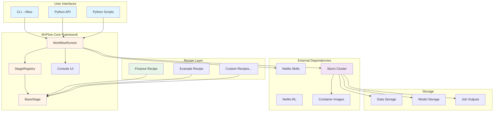
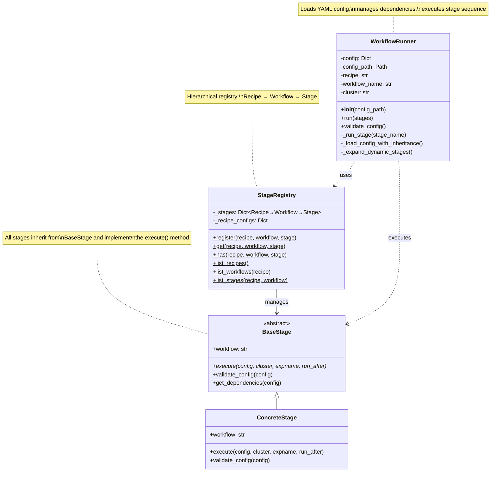
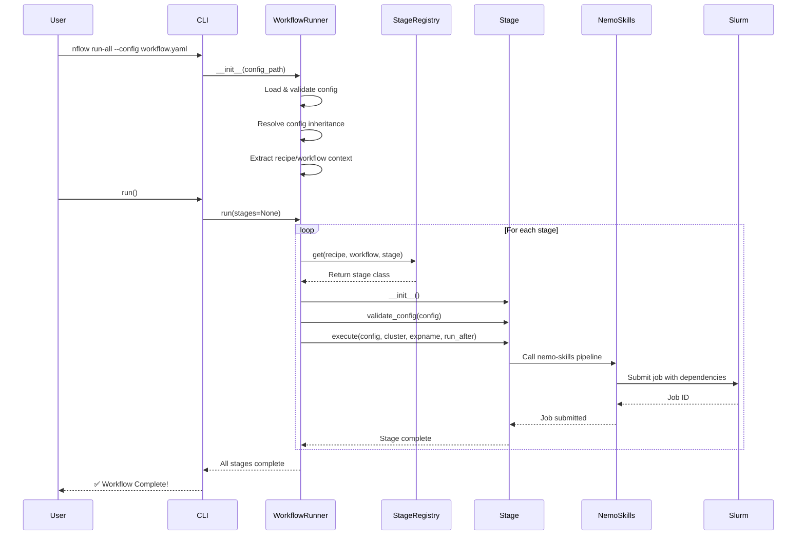
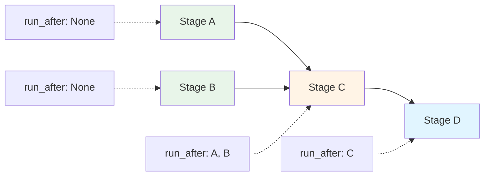
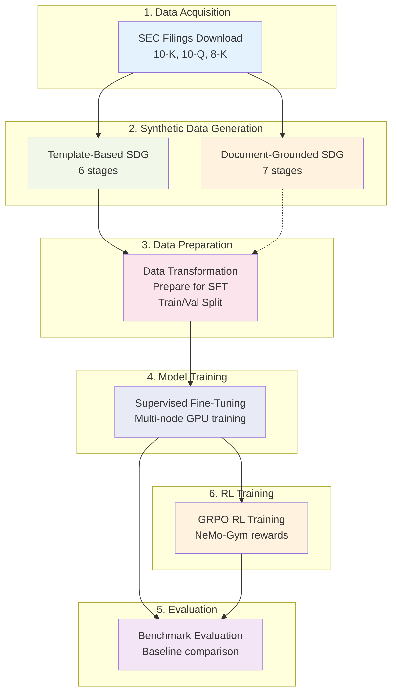
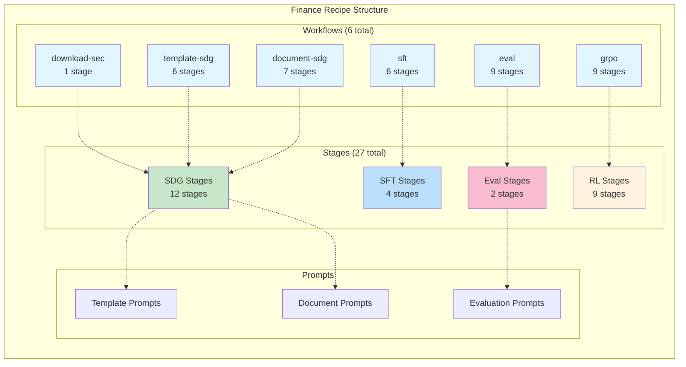
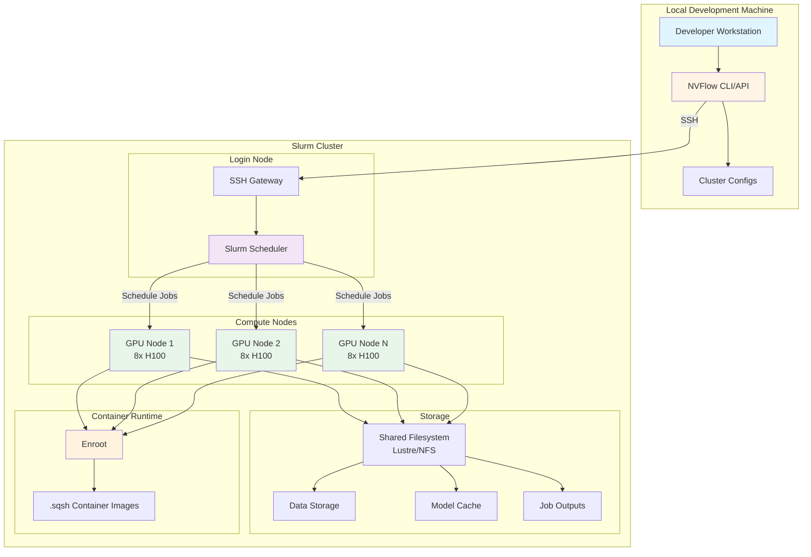
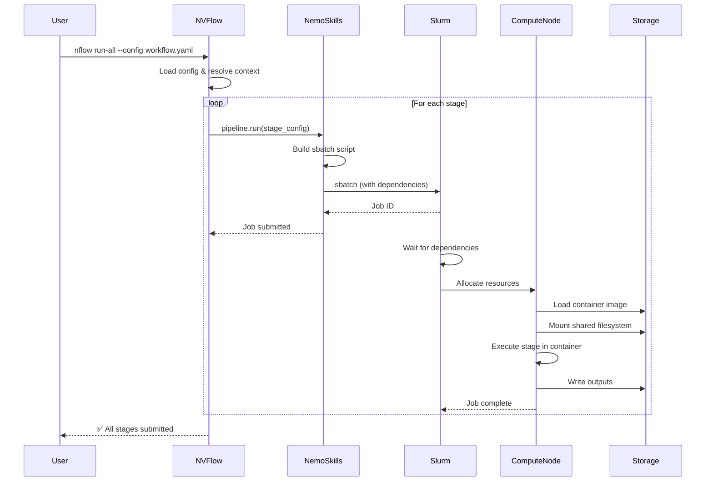
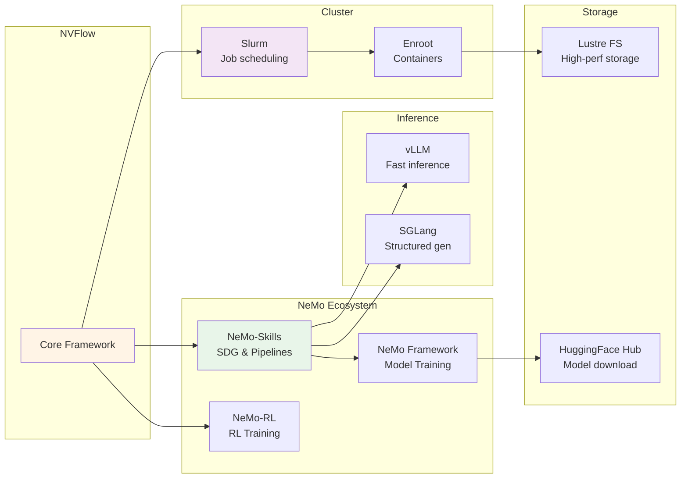
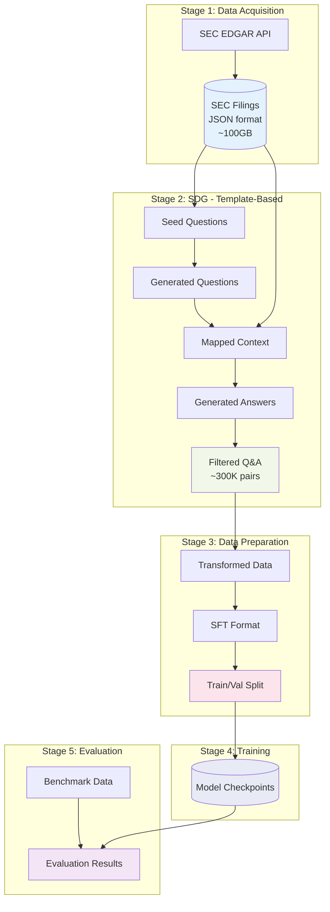

# NVFlow Architecture

> **Version:** 1.0
> **Last Updated:** January 21, 2026
> **Purpose:** Comprehensive architectural overview of the NVFlow orchestration framework

---

## Table of Contents

1. [High-Level Architecture](#1-high-level-architecture)
2. [System Overview](#2-system-overview)
3. [Core Framework Components](#3-core-framework-components)
4. [Hierarchical Organization](#4-hierarchical-organization)
5. [Execution Flow](#5-execution-flow)
6. [Finance Recipe Architecture](#6-finance-recipe-architecture)
7. [Deployment Architecture](#7-deployment-architecture)
8. [Technology Stack](#8-technology-stack)
9. [Data Flow](#9-data-flow)

---

## 1. High-Level Architecture



---

## 2. System Overview

### Architecture Principles

**NVFlow** follows a **layered, modular architecture** with clear separation of concerns:

```
┌─────────────────────────────────────────────────────┐
│               USER INTERFACES                        │
│  CLI (nflow) │ Python API │ Scripts                 │
└─────────────────────────────────────────────────────┘
                        ↓
┌─────────────────────────────────────────────────────┐
│            ORCHESTRATION LAYER                       │
│  WorkflowRunner │ Config Management │ Dependencies  │
└─────────────────────────────────────────────────────┘
                        ↓
┌─────────────────────────────────────────────────────┐
│             REGISTRY LAYER                           │
│  StageRegistry (Recipe → Workflow → Stage)          │
└─────────────────────────────────────────────────────┘
                        ↓
┌─────────────────────────────────────────────────────┐
│              EXECUTION LAYER                         │
│  BaseStage │ Stage Implementations                   │
└─────────────────────────────────────────────────────┘
                        ↓
┌─────────────────────────────────────────────────────┐
│          INFRASTRUCTURE LAYER                        │
│  NeMo-Skills │ Slurm │ Containers │ Storage         │
└─────────────────────────────────────────────────────┘
```

### Key Design Patterns

1. **Template Method Pattern**: `BaseStage` defines the interface, concrete stages implement `execute()`
2. **Registry Pattern**: `StageRegistry` provides hierarchical discovery and registration
3. **Strategy Pattern**: Different execution strategies (local, Slurm) via configuration
4. **Decorator Pattern**: `@StageRegistry.register()` for stage registration
5. **Dependency Injection**: Configuration and cluster info injected into stages

---

## 3. Core Framework Components



### Component Responsibilities

#### **BaseStage** (Abstract Base Class)
- Defines the contract for all stages
- Provides template methods for execution
- Handles validation and dependency resolution
- **Key Method**: `execute(config, cluster, expname, run_after)`

#### **StageRegistry** (Singleton Registry)
- Maintains hierarchical mapping: Recipe → Workflow → Stage → Class
- Provides discovery and lookup capabilities
- Supports workflow ordering from configuration
- **Key Methods**: `register()`, `get()`, `list_*()` operations

#### **WorkflowRunner** (Orchestrator)
- Loads and validates YAML configurations
- Supports config inheritance via `_base_` key
- Manages stage execution order and dependencies
- Generates unique experiment names per stage
- **Key Methods**: `run()`, `validate_config()`

#### **Console** (UI Component)
- Provides rich terminal output with colors and formatting
- Displays headers, sections, details, and progress
- Enhances user experience during workflow execution

---

## 4. Hierarchical Organization

### Three-Level Hierarchy

```
Recipe (Domain-specific collection)
  ↓
Workflow (Pipeline definition)
  ↓
Stage (Execution unit)
```

### Structure in Code

```
nvflow/
├── core/                           # Framework layer
│   ├── base_stage.py              # Abstract base class
│   ├── stage_registry.py          # Hierarchical registry
│   ├── workflow_runner.py         # Orchestration engine
│   └── console.py                 # UI components
│
├── cli/                            # User interface layer
│   └── main.py                    # CLI commands
│
├── lib/                            # Shared libraries
│   └── rl/                        # RL utilities (rollout, verify, helpers)
│
└── recipes/                        # Recipe layer
    ├── finance/                   # Finance domain
    │   ├── stages/                # Stage implementations
    │   │   ├── download/         # SEC filing download
    │   │   ├── sdg/              # SDG stages
    │   │   ├── sft/              # SFT training stages
    │   │   ├── shared/           # Shared stages (data_transformation, train_validation_split)
    │   │   ├── rl/               # GRPO RL training stages
    │   │   └── evaluation/       # Eval stages
    │   ├── utils/                 # Utility sub-packages
    │   │   ├── download/         # Download utilities
    │   │   ├── sdg/              # SDG utilities
    │   │   ├── sft/              # SFT utilities
    │   │   ├── rl/               # RL utilities
    │   │   ├── shared/           # Shared utilities
    │   │   └── evaluation/       # Evaluation utilities
    │   ├── workflows/             # Workflow configs
    │   │   ├── download_sec_filings.yaml
    │   │   ├── sdg/
    │   │   │   ├── template-based-sdg.yaml
    │   │   │   ├── template-based-sdg-demo.yaml
    │   │   │   └── document-grounded-sdg.yaml
    │   │   ├── sft/
    │   │   │   └── qwen3_14b.yaml
    │   │   ├── eval/
    │   │   │   ├── base.yaml       # Shared benchmarks, judges, datasets
    │   │   │   ├── demo.yaml       # Demo evaluation
    │   │   │   └── baselines.yaml  # Baseline model evaluation
    │   │   └── grpo/
    │   │       └── qwen3_4b.yaml
    │   └── prompts/               # Prompt templates
    │
    └── example/                   # Example recipe
        ├── stages/sdg/
        ├── workflows/
        └── prompts/
```

### Registration Example

```python
# Stage registration uses decorator pattern
@StageRegistry.register(
    recipe="finance",
    workflow="training_sft",
    stage="sft"
)
class SFTStage(BaseStage):
    workflow = "training_sft"

    def execute(self, config, cluster, expname, run_after=None):
        # Implementation
        pass
```

### Workflow Configuration Example

```yaml
recipe: finance
workflow:
  name: training_sft
  type: training

cluster: my_cluster

pipeline_stages:
  - data_transformation
  - prepare_for_sft
  - train_validation_split
  - training

stages:
  data_transformation:
    input_dir: /data/raw
    output_dir: /data/processed

  training:
    num_nodes: 32
    num_gpus_per_node: 8
    dependencies:
      - data_transformation
      - prepare_for_sft
      - train_validation_split
```

---

## 5. Execution Flow

### Complete Execution Sequence



### Dependency Resolution



**Dependency Handling:**
1. WorkflowRunner reads `dependencies` from stage config
2. Generates experiment names for all dependencies
3. Passes as `run_after` parameter to dependent stage
4. Slurm uses job dependencies to ensure correct execution order

---

## 6. Finance Recipe Architecture

### Pipeline Overview



### Workflow Breakdown

#### **Workflow 1: Download SEC Filings**
```
Input: Ticker list (demo/S&P 500)
Output: ~100GB SEC filings (JSON format)
Stages: 1
GPU: None (CPU only)
```

#### **Workflow 2: Template-Based SDG** (Production)
```
Stages:
  1. create_seed_data         - Generate seed questions
  2. generate_questions       - Adapt to companies/years
  3. map_questions_to_context - Find relevant SEC sections
  4. generate_answers         - Generate answers with LLM
  5. genselect_answers        - Self-consistency filtering
  6. filter_answers           - Quality filtering

Output: ~300K Q&A pairs
GPU: 16 GPUs (max per stage)
Models: GPT-OSS-120B, Qwen3-14B
```

#### **Workflow 3: Document-Grounded SDG** (Experimental)
```
Stages:
  1. dg_sdg_preprocess                    - Preprocess filings
  2. document_grounded_qa_generation      - Generate verified Q&A
  3. genselect_answers                    - Self-consistency check
  4. evaluate_answers                     - Quality evaluation
  5. aggregate_answers                    - Combine results
  6. difficulty_estimation                - Stratify by difficulty
  7. document_grounded_data               - Prepare training data

Output: ~800K Q&A pairs (stratified)
GPU: 8 GPUs
Models: Qwen3 family (14B-235B)
```

#### **Workflow 4: Supervised Fine-Tuning**
```
Stages:
  1. data_transformation       - Convert to training format
  2. prepare_for_sft          - Format for NeMo
  3. train_validation_split   - Split dataset
  4. sequence_length_grouping - [Optional] Group by length
  5. training                 - Multi-node training
  6. convert_to_messages      - [Optional] Post-processing

GPU: 256 GPUs (32 nodes × 8 GPUs)
Model: Qwen3-14B
Parallelism: TP=2, PP=1, CP=2
```

#### **Workflow 5: Evaluation**
```
Stages:
  1. prepare_data              - Prepare benchmarks
  2-N. evaluate_checkpoints    - Evaluate each checkpoint
  N+1-M. evaluate_baselines    - Evaluate baseline models

Output: Accuracy, F1, category metrics
GPU: 8 GPUs per eval job
Benchmarks: Financial reasoning tasks
```

#### **Workflow 6: GRPO RL Training**
```
Stages:
  1. data_transformation       - SDG cleanup to model-agnostic schema
  2. apply_prompt_template     - Apply prompt template + extract answer
  3. convert_to_responses_api  - Convert to NeMo-Gym Responses API format
  4. train_validation_split    - Split into train/val sets
  5. prepare_data              - Add agent routing fields
  6. collect_rollouts          - Rollout collection + reward profiling
  7. compute_rewards           - [Optional] Re-judge with different model
  8. training                  - GRPO training with NeMo-Gym
  9. eval                      - Evaluate checkpoints on benchmarks

Output: RL-trained model + eval results
GPU: 8 GPUs (1 node for demo)
Model: Qwen3-4B (demo), extensible to larger models
```

### Finance Recipe Component Diagram



---

## 7. Deployment Architecture

### Cluster Deployment



### Container Architecture

```
┌─────────────────────────────────────────────────────┐
│          Container Images (.sqsh format)            │
├─────────────────────────────────────────────────────┤
│                                                      │
│  ┌──────────────┐  ┌──────────────┐               │
│  │ nemo-skills  │  │    vLLM      │               │
│  │   (0.7.1)    │  │  (v0.10.2)   │               │
│  └──────────────┘  └──────────────┘               │
│                                                      │
│  ┌──────────────┐  ┌──────────────┐               │
│  │   SGLang     │  │   NeMo-RL    │               │
│  │  (v0.5.4)    │  │   (0.7.0)    │               │
│  └──────────────┘  └──────────────┘               │
│                                                      │
│  ┌──────────────┐  ┌──────────────┐               │
│  │   NeMo FW    │  │   PyTorch    │               │
│  │              │  │              │               │
│  └──────────────┘  └──────────────┘               │
└─────────────────────────────────────────────────────┘
                       ↓
┌─────────────────────────────────────────────────────┐
│              Shared Filesystem Mounts                │
├─────────────────────────────────────────────────────┤
│  /workspace → /lustre/.../workspace                 │
│  /hf_models → /lustre/.../models/hf_models          │
│  /outputs   → /lustre/.../outputs                   │
└─────────────────────────────────────────────────────┘
```

### Job Submission Flow



---

## 8. Technology Stack

### Framework Dependencies

```yaml
Core Framework:
  - Python: 3.12+
  - OmegaConf: YAML config management
  - Typer: CLI interface
  - Rich: Terminal UI

Execution:
  - NeMo-Skills: Pipeline execution & SDG
  - NeMo-RL: Reinforcement learning integration
  - Slurm: Cluster workload manager
  - Enroot: Container runtime

Infrastructure:
  - uv: Package manager
  - pre-commit: Code quality
  - pytest: Testing
  - ruff: Linting & formatting
  - mypy: Type checking

Models:
  - vLLM: Inference server
  - SGLang: Structured generation
  - HuggingFace Transformers: Model loading
```

### External Integrations



---

## 9. Data Flow

### Complete Data Pipeline (Finance Recipe)



### Storage Layout

```
/lustre/fsw/.../workspace/nvflow/
│
├── cluster_configs/                  # Cluster configuration
│   ├── containers.yaml              # Container definitions
│   ├── my_cluster.yaml              # User cluster config
│   └── template-slurm.yaml          # Template config
│
├── nvflow/                        # Framework code
│   ├── core/                        # Core components
│   ├── cli/                         # CLI interface
│   ├── lib/                         # Shared libraries (RL utilities)
│   └── recipes/                     # Recipe implementations
│       ├── finance/
│       └── example/
│
├── jobs/                             # Job execution artifacts
│   └── experiments/
│       ├── download-sec-demo/
│       ├── template_based_sdg-*/
│       ├── sft-training-*/
│       └── eval-*/
│           └── nemo-run/
│               ├── code/            # Packaged code snapshot
│               ├── logs/            # Execution logs
│               └── results/         # Stage outputs
│
├── outputs/                          # Output data
│   ├── finance/
│   │   ├── sec_filings/            # Downloaded filings (~100GB)
│   │   ├── sdg/                    # Generated Q&A datasets
│   │   ├── sft/                    # Training data & checkpoints
│   │   └── eval/                   # Evaluation results
│   └── logs/                        # Setup logs
│
└── models/                           # Model storage
    └── hf_models/                   # HuggingFace models
        ├── Qwen/
        ├── GPT-OSS-120B/
        └── Nemotron/
```

---

## Summary

### Key Architectural Highlights

1. **Modular Design**: Clear separation between framework, recipes, and infrastructure
2. **Hierarchical Organization**: Recipe → Workflow → Stage provides natural organization
3. **Declarative Configuration**: YAML-based configs with inheritance support
4. **Flexible Execution**: CLI, Python API, and programmatic interfaces
5. **Cluster Native**: First-class Slurm integration with dependency management
6. **Extensible**: Easy to add new recipes, workflows, and stages
7. **Built on NeMo**: Leverages NVIDIA's NeMo ecosystem (Skills, RL, Framework)

### Design Benefits

- **Reproducibility**: Version-controlled configs and deterministic execution
- **Reusability**: Stages can be shared across workflows and recipes
- **Scalability**: Seamless scaling from local development to multi-node clusters
- **Maintainability**: Clear structure and separation of concerns
- **Discoverability**: Registry pattern enables stage discovery and documentation

---

**Document Version:** 1.0
**Generated:** January 21, 2026
**Repository:** nvflow
