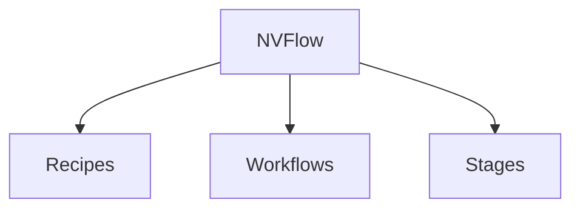

# NVFlow - Architecture Diagrams Summary

> **Created:** January 21, 2026
> **Purpose:** Quick reference guide for all architectural diagrams

---

## 📦 What's Included

A comprehensive set of architectural diagrams and documentation for the NVFlow orchestration framework has been created:

### 📄 Main Documentation
- **[ARCHITECTURE.md](./ARCHITECTURE.md)** - Complete architectural documentation (26 KB)
  - High-level architecture overview
  - System components and design patterns
  - Hierarchical organization (Recipe → Workflow → Stage)
  - Execution flow and dependency management
  - Finance recipe detailed architecture
  - Deployment topology
  - Technology stack
  - Data flow diagrams

### 📊 Mermaid Diagrams (in `diagrams/` folder)

1. **[architecture-overview.mmd](../diagrams/architecture-overview.mmd)** - High-level system architecture
   - Shows all major components and their relationships
   - User interfaces → Core framework → Recipes → Infrastructure → Storage

2. **[finance-pipeline.mmd](../diagrams/finance-pipeline.mmd)** - Finance recipe end-to-end pipeline
   - Complete data flow from SEC filings to model evaluation
   - All 6 workflows with 27 stages visualized
   - Production vs. experimental paths

3. **[execution-flow.mmd](../diagrams/execution-flow.mmd)** - Runtime execution sequence
   - Step-by-step workflow execution
   - User command → Config loading → Stage execution → Job submission
   - Background Slurm job processing

4. **[component-architecture.mmd](../diagrams/component-architecture.mmd)** - Class diagram
   - Core framework classes and relationships
   - BaseStage, StageRegistry, WorkflowRunner
   - Concrete stage implementations
   - External dependencies

5. **[deployment-architecture.mmd](../diagrams/deployment-architecture.mmd)** - Infrastructure view
   - Local development environment
   - Slurm cluster topology
   - Compute nodes, storage, containers
   - Network connections and data flow

### 📖 Diagram Documentation
- **[diagrams/README.md](../diagrams/README.md)** - Guide for viewing and editing diagrams
  - Description of each diagram
  - Multiple viewing options (online, VS Code, CLI, GitHub)
  - Mermaid syntax reference
  - Style guide and contribution guidelines

---

## 🚀 Quick Start Guide

### Viewing the Architecture

**Option 1: Read the comprehensive documentation**
```bash
cat ARCHITECTURE.md
# or open in your favorite markdown viewer
code ARCHITECTURE.md
```

**Option 2: View diagrams online**
1. Visit https://mermaid.live/
2. Open any `.mmd` file from `diagrams/`
3. Copy-paste the content
4. View and export as needed

**Option 3: Generate PNG images**
```bash
cd diagrams/

# Install Mermaid CLI if not already installed
npm install -g @mermaid-js/mermaid-cli

# Generate all diagrams as PNG
mmdc -i architecture-overview.mmd -o architecture-overview.png
mmdc -i finance-pipeline.mmd -o finance-pipeline.png
mmdc -i execution-flow.mmd -o execution-flow.png
mmdc -i component-architecture.mmd -o component-architecture.png
mmdc -i deployment-architecture.mmd -o deployment-architecture.png
```

**Option 4: VS Code with Mermaid Preview**
1. Install "Mermaid Preview" extension
2. Open any `.mmd` file
3. Right-click → "Mermaid: Preview"

---

## 🎯 Which Diagram Should I Use?

### For Different Audiences

| Audience | Recommended Diagrams | Purpose |
|----------|---------------------|---------|
| **New Users** | `architecture-overview.mmd` | Get a high-level understanding of the system |
| **Data Scientists** | `finance-pipeline.mmd` | Understand the ML pipeline and data flow |
| **ML Engineers** | `execution-flow.mmd`, `finance-pipeline.mmd` | Learn how to run and debug workflows |
| **Software Engineers** | `component-architecture.mmd` | Understand code structure and extend the framework |
| **DevOps/Infrastructure** | `deployment-architecture.mmd` | Set up cluster and infrastructure |
| **System Architects** | All diagrams + `ARCHITECTURE.md` | Comprehensive system understanding |
| **Contributors** | `component-architecture.mmd`, `ARCHITECTURE.md` | Contribute new stages and recipes |

### For Different Questions

| Question | Diagram to Check |
|----------|------------------|
| "What does NVFlow do?" | `architecture-overview.mmd` |
| "How do I build an ML pipeline?" | `finance-pipeline.mmd` |
| "How does stage execution work?" | `execution-flow.mmd` |
| "How do I create a new stage?" | `component-architecture.mmd` |
| "What infrastructure do I need?" | `deployment-architecture.mmd` |
| "How are stages organized?" | `component-architecture.mmd` |
| "How does the finance recipe work?" | `finance-pipeline.mmd` |
| "How does NVFlow integrate with Slurm?" | `deployment-architecture.mmd`, `execution-flow.mmd` |

---

## 📋 Diagram Details

### 1. Architecture Overview
```
Components Shown:
✓ User Interfaces (CLI, Python API, Scripts)
✓ Core Framework (WorkflowRunner, StageRegistry, BaseStage, Console)
✓ Recipe Layer (Finance, Example, Custom recipes)
✓ External Dependencies (NeMo-Skills, NeMo-RL, Slurm, Containers)
✓ Storage Layer (Data, Models, Outputs)

Use Case: Understanding system boundaries and component relationships
```

### 2. Finance Pipeline
```
Coverage:
✓ Complete 6-workflow pipeline (27 stages total)
✓ Data acquisition (SEC filings download)
✓ SDG (Template-based & Document-grounded approaches)
✓ Data preparation (Transformation, formatting, splitting)
✓ Training (Multi-node SFT with Qwen3-14B)
✓ Evaluation (Benchmarks and baselines)

Use Case: Understanding the end-to-end ML pipeline
```

### 3. Execution Flow
```
Phases Covered:
✓ Initialization (Config loading, validation)
✓ Validation (Registry checks, config validation)
✓ Execution (Stage execution loop, job submission)
✓ Monitoring (Job status, log viewing)

Use Case: Debugging and understanding runtime behavior
```

### 4. Component Architecture
```
Classes Documented:
✓ BaseStage (abstract base class)
✓ StageRegistry (hierarchical registry)
✓ WorkflowRunner (orchestrator)
✓ Concrete stages (SFT, Generate, Download, Evaluate)
✓ CLI (user interface)
✓ External dependencies (NeMo-Skills, OmegaConf)

Use Case: Code navigation and extension
```

### 5. Deployment Architecture
```
Infrastructure Components:
✓ Local development machine (NVFlow installation)
✓ SSH tunnel (secure connection)
✓ Slurm cluster (login node, scheduler, compute nodes)
✓ GPU compute nodes (H100 GPUs, containers)
✓ Shared storage (Lustre/NFS filesystem)
✓ Container runtime (Enroot, .sqsh images)

Use Case: Cluster setup and deployment planning
```

---

## 🎨 Diagram Rendering Examples

### In Markdown (GitLab/GitHub)
````markdown

````

### In Python Documentation
```python
"""
Architecture:
    Recipe → Workflow → Stage

    See: diagrams/architecture-overview.mmd
"""
```

### In Presentations
- Export diagrams to PNG/SVG using `mmdc` CLI
- Import into PowerPoint/Keynote/Google Slides
- High resolution for professional presentations

---

## 📊 Diagram Statistics

| Metric | Count |
|--------|-------|
| Total Diagrams | 5 |
| Total Documentation Pages | 2 (ARCHITECTURE.md + diagrams/README.md) |
| Components Visualized | 50+ |
| Workflows Documented | 6 |
| Stages Documented | 27 |
| Architecture Layers | 5 |

---

## 🔄 Keeping Diagrams Updated

When updating the codebase:

1. **Adding a new recipe:**
   - Update `architecture-overview.mmd` (Recipe Layer section)
   - Consider creating a new pipeline diagram (like `finance-pipeline.mmd`)

2. **Adding a new stage:**
   - Update recipe-specific pipeline diagram
   - Update `component-architecture.mmd` if it's a new pattern

3. **Changing core framework:**
   - Update `component-architecture.mmd`
   - Update `execution-flow.mmd` if execution logic changes
   - Update `ARCHITECTURE.md` with detailed explanations

4. **Infrastructure changes:**
   - Update `deployment-architecture.mmd`
   - Update cluster setup documentation

5. **Major architectural changes:**
   - Review and update all diagrams
   - Update `ARCHITECTURE.md` comprehensively

---

## 📖 Related Documentation

- **[README.md](../../README.md)** - Main project documentation
- **[INSTALL.md](../../INSTALL.md)** - Installation and setup guide
- **[docs/recipes/finance/README.md](../recipes/finance/README.md)** - Finance recipe documentation
- **[docs/recipes/finance/quick-start.md](../recipes/finance/quick-start.md)** - Quick start guide

---

## 🤝 Contributing

To contribute to the architecture documentation:

1. **For diagram updates:**
   - Edit the `.mmd` files in `diagrams/`
   - Test rendering before committing
   - Follow the style guide in `diagrams/README.md`

2. **For documentation updates:**
   - Edit `ARCHITECTURE.md` for comprehensive changes
   - Keep diagrams and text synchronized
   - Use consistent terminology

3. **For new diagrams:**
   - Create new `.mmd` file in `diagrams/`
   - Add description to `diagrams/README.md`
   - Update this summary file

---

## 📄 License

All architecture diagrams and documentation are part of the NVFlow project and follow the Apache-2.0 license.

---

## 🙏 Acknowledgments

Built on the NVIDIA NeMo ecosystem:
- [NeMo-Skills](https://github.com/NVIDIA/NeMo-Skills)
- [NeMo-RL](https://github.com/NVIDIA/NeMo-RL)
- [NeMo Framework](https://github.com/NVIDIA/NeMo)

---

**Version:** 1.0
**Last Updated:** January 21, 2026
**Maintained by:** NVFlow Team
